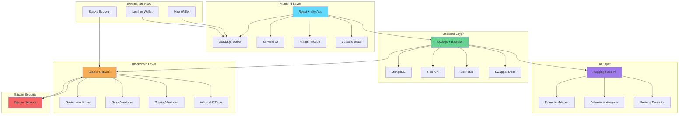
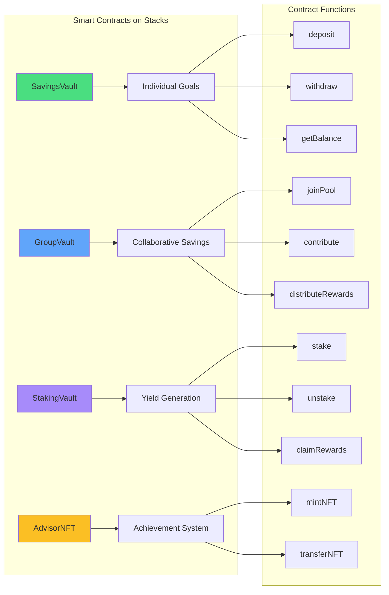
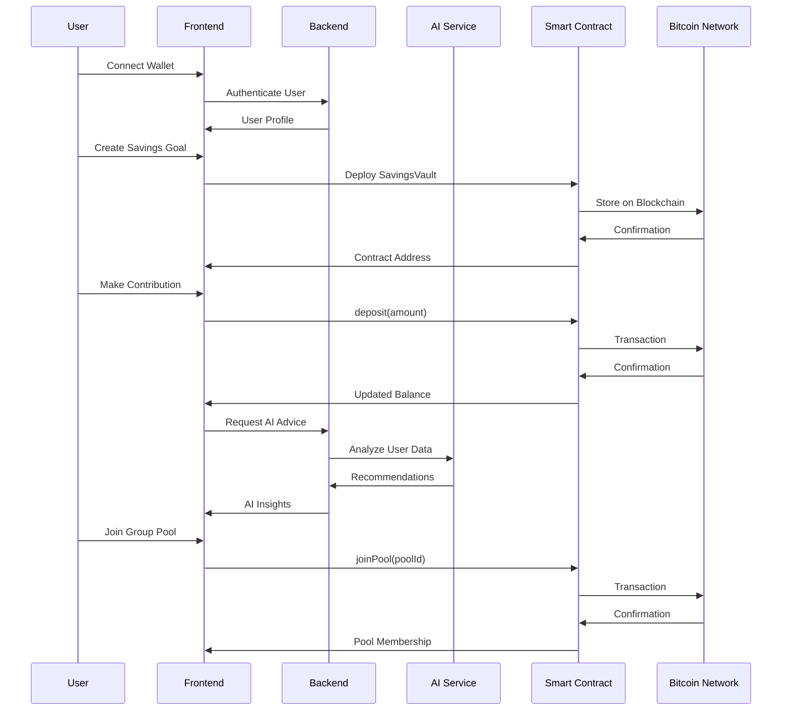
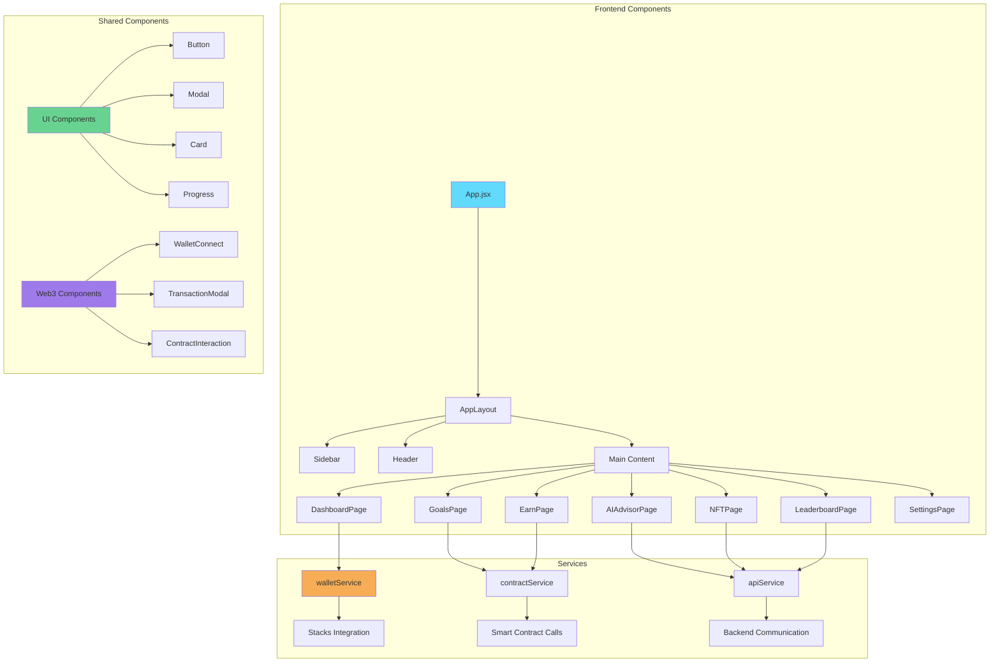
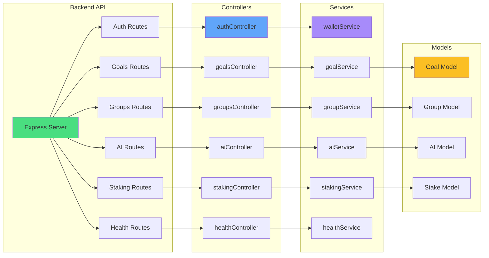
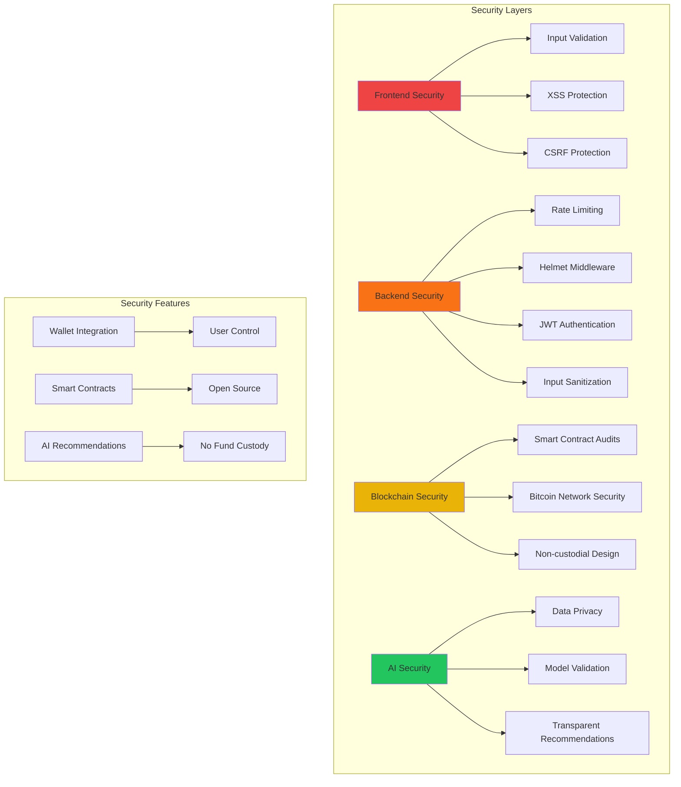
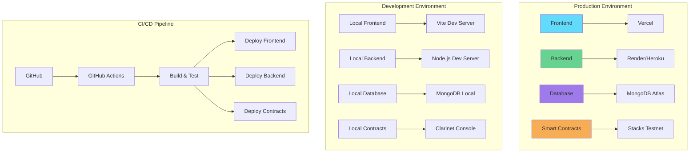
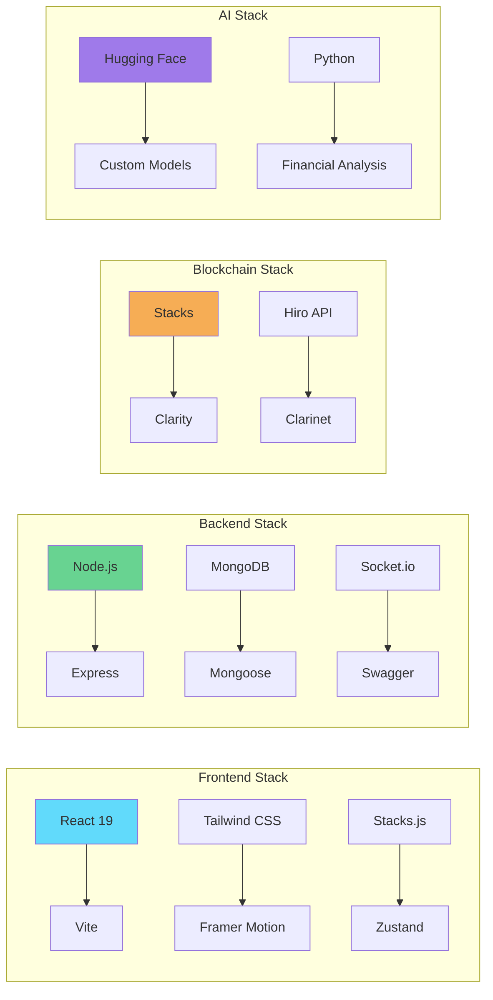

# LoopFi Architecture Diagram

This document contains the visual architecture diagram for LoopFi - AI-Powered DeFi Savings Platform on Bitcoin.

## System Architecture Overview

## Smart Contract Architecture

## Data Flow Architecture

## Component Architecture

## API Architecture

## Security Architecture

## Deployment Architecture

## Technology Stack Summary

This architecture diagram shows the complete system design of LoopFi, demonstrating how all components work together to create a secure, scalable, and user-friendly DeFi savings platform on Bitcoin's Layer 2.
