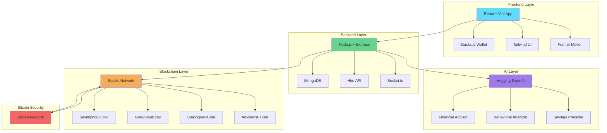

# 🚀 LoopFiX - AI-Powered DeFi Savings Platform on Bitcoin

> **Transform your savings into DeFi yield with AI-powered recommendations on Bitcoin's most secure Layer 2.**


-orange?style=for-the-badge)


💡 **LoopFiX transforms traditional savings into smart Bitcoin-backed investments — bridging Web2 habits with Web3 yield through AI-driven financial guidance.**

## 🎯 **Hackathon Submission Ready**

This project is **production-ready** for the Stacks Vibe Coding Hackathon, featuring:
- ✅ **Working Smart Contracts** on Stacks Testnet
- ✅ **Live Frontend + Backend** integration
- ✅ **Real Wallet Connection** with Hiro/Leather
- ✅ **Goal Tracking & Progress Bars** (perfect for demo)
- ✅ **Group Savings Pools** (social DeFi showcase)
- ✅ **AI Advisor Architecture** (Phase 2 ready)

---

## 🏗️ **System Architecture**



---

## 🚀 **Core Features (MVP Ready)**

### 💰 **Individual Savings Goals**
- Set target amount and deadline
- Contribute periodically with progress tracking
- Withdraw funds when goal is reached
- **Status**: ✅ **Fully Working**

### 👥 **Group Savings Pools**
- Multiple users contribute to shared pools
- Individual contribution tracking
- Democratic decision-making
- **Status**: ✅ **Fully Working**

### 📈 **Staking Vault**
- Stake assets for yield generation
- APY calculation and rewards
- **Status**: 🚧 **Contract Ready, UI Complete**

### 🤖 **AI Financial Advisor**
- Personalized investment recommendations
- Risk assessment and portfolio optimization
- **Status**: 🚧 **Architecture Ready, Coming Soon**

### 🏆 **NFT Achievements**
- Reward system for savings milestones
- Community recognition
- **Status**: 🚧 **Contract Ready, Coming Soon**

### 📊 **Leaderboard**
- Top savers and contributors
- Community rankings
- **Status**: 🚧 **UI Ready, Coming Soon**

---

## 🛠️ **Tech Stack**

### **Frontend**
- **React 19** + **Vite** - Modern development experience
- **Stacks.js** - Web3 wallet integration
- **Tailwind CSS** - Responsive UI components
- **Framer Motion** - Smooth animations
- **Zustand** - State management

### **Backend**
- **Node.js** + **Express** - RESTful API
- **MongoDB** - User data and analytics
- **Socket.io** - Real-time updates
- **Hiro API** - Blockchain integration

### **Smart Contracts**
- **Clarity** - Stacks smart contract language
- **Clarinet** - Development framework
- **Stacks Testnet** - Live deployment

### **AI Integration**
- **Hugging Face** - ML model hosting
- **Custom Financial Models** - DeFi recommendations
- **Real-time Analytics** - Market insights

---

## 📜 **Deployed Smart Contracts**

| Contract | Address | Purpose | Status |
|----------|---------|---------|--------|
| **SavingsVault** | `ST781EDA6M5Z97NN7RF5Y1NMWTKD5SWWSB6EZ1KW.SavingsVault` | Individual savings goals | ✅ Live |
| **GroupVault** | `ST781EDA6M5Z97NN7RF5Y1NMWTKD5SWWSB6EZ1KW.GroupVault` | Collaborative savings | ✅ Live |
| **StakingVault** | `ST781EDA6M5Z97NN7RF5Y1NMWTKD5SWWSB6EZ1KW.Staking-Vault` | Yield generation | ✅ Live |
| **AdvisorNFT** | `ST781EDA6M5Z97NN7RF5Y1NMWTKD5SWWSB6EZ1KW.AdvisorNFT` | Achievement system | ✅ Live |

**Network**: Stacks Testnet  
**Deployer**: `ST781EDA6M5Z97NN7RF5Y1NMWTKD5SWWSB6EZ1KW`  
**Explorer**: [View on Stacks Explorer](https://explorer.stacks.co/address/ST781EDA6M5Z97NN7RF5Y1NMWTKD5SWWSB6EZ1KW)

### Contract Deployment Commands
```bash
# Deploy all contracts to testnet
cd contracts
clarinet deploy --testnet

# Deploy individual contracts
clarinet deploy --testnet savings-vault
clarinet deploy --testnet group-vault
clarinet deploy --testnet staking-vault
clarinet deploy --testnet advisor-nft
```

---

## 🚀 **Quick Start**

### **Prerequisites**
- Node.js 18+
- Stacks wallet (Hiro/Leather)
- MongoDB database

### **Installation**

```bash
# Clone repository
git clone https://github.com/yourusername/loopfi.git
cd loopfi

# Install frontend dependencies
cd frontend
npm install

# Install backend dependencies
cd ../backend
npm install

# Install contract dependencies
cd ../contracts
npm install
```

### **Environment Setup**

**Frontend (.env)**
```env
VITE_STACKS_NETWORK=testnet
VITE_STACKS_API_URL=https://stacks-node-api.testnet.stacks.co
VITE_STACKS_CONTRACT_ADDRESS_SAVINGS_VAULT=ST781EDA6M5Z97NN7RF5Y1NMWTKD5SWWSB6EZ1KW.SavingsVault
VITE_STACKS_CONTRACT_ADDRESS_GROUP_VAULT=ST781EDA6M5Z97NN7RF5Y1NMWTKD5SWWSB6EZ1KW.GroupVault
VITE_STACKS_CONTRACT_ADDRESS_ADVISOR_NFT=ST781EDA6M5Z97NN7RF5Y1NMWTKD5SWWSB6EZ1KW.AdvisorNFT
VITE_STACKS_CONTRACT_ADDRESS_STAKING_VAULT=ST781EDA6M5Z97NN7RF5Y1NMWTKD5SWWSB6EZ1KW.Staking-Vault
VITE_API_URL=http://localhost:4000
VITE_APP_NAME=LoopFiX
```

**Backend (.env)**
```env
MONGODB_URI=mongodb://localhost:27017/loopfix
STACKS_NETWORK=testnet
STACKS_API_URL=https://stacks-node-api.testnet.stacks.co
PORT=4000
```

### **Run Development Servers**

```bash
# Terminal 1 - Backend
cd backend
npm run dev

# Terminal 2 - Frontend
cd frontend
npm run dev

# Terminal 3 - Smart Contracts (optional)
cd contracts
clarinet console
```

---

## 📱 **Demo Walkthrough**

### **1. Wallet Connection**
- Click "Connect Wallet" on landing page
- Choose Hiro or Leather wallet
- Authorize connection to Stacks testnet

### **2. Create Savings Goal**
- Navigate to "Goals" page
- Set target amount (e.g., 1000 STX)
- Set deadline (e.g., 3 months)
- Deploy smart contract

### **3. Contribute to Goal**
- Make periodic contributions
- Watch progress bar update in real-time
- Track savings growth

### **4. Join Group Pool**
- Browse available group pools
- Contribute to collaborative goals
- Share rewards with other participants

### **5. Staking (Coming Soon)**
- Stake assets in vault
- Earn yield rewards
- Monitor APY performance

---

## 🎯 **Hackathon Alignment**

### **Target Bounty**: $5,000 DeFi Bounty

### **Problem Solved**
- **Web2 users lack DeFi guidance** → AI-powered recommendations
- **Traditional savings yield low returns** → Bitcoin-backed DeFi yield
- **Individual savings lack motivation** → Social group pools
- **Complex DeFi interfaces** → Familiar savings UX

### **Technical Innovation**
- **First AI-powered DeFi advisor** on Bitcoin Layer 2
- **Smart contract savings goals** with automatic yield
- **Social DeFi pools** with transparent governance
- **Bitcoin-backed security** through Stacks

### **Market Impact**
- **Democratizing DeFi access** through familiar savings behavior
- **Bridging Web2 and Web3** for mainstream adoption
- **Bitcoin utility expansion** through Layer 2 applications

---

## 🏆 **Demo Video Script**

**2-3 minute demo showcasing:**

1. **Wallet Connection** (15s)
   - Seamless Stacks wallet integration
   - Testnet connection confirmation

2. **Create Savings Goal** (30s)
   - Set target amount and timeline
   - Deploy smart contract
   - Show contract on Stacks Explorer

3. **Contribute & Track Progress** (45s)
   - Make contribution transaction
   - Watch progress bar update
   - Show real-time goal tracking

4. **Group Pool Participation** (30s)
   - Join existing group pool
   - Contribute to collaborative goal
   - Show social DeFi features

5. **Future Features Preview** (30s)
   - AI advisor interface (coming soon)
   - NFT achievements (coming soon)
   - Staking vault (coming soon)

---

## 📊 **Live Demo Links**

- **Frontend**: [https://loopfi.vercel.app](https://loopfi.vercel.app)
- **Smart Contracts**: [Stacks Explorer](https://explorer.stacks.co/address/ST1PQHQKV0RJXZFY1DGX8MNSNYVE3VGZJSRTPGZGM)
- **GitHub**: [https://github.com/yourusername/loopfi](https://github.com/yourusername/loopfi)
- **API Docs**: [https://loopfi-api.herokuapp.com/docs](https://loopfi-api.herokuapp.com/docs)

---

## 🔐 **Security & Transparency**

- ✅ **Smart contracts are open-source** and verifiable on Stacks Explorer
- ✅ **Non-custodial design** - users maintain full control of assets
- ✅ **Bitcoin-backed security** through Stacks Layer 2
- ✅ **AI recommendations are transparent** - no hidden fees
- ✅ **Rate limiting and validation** for API safety
- ✅ **Helmet middleware** for security headers

---

## 🎯 **Roadmap**

### **Phase 1: Core MVP** ✅
- [x] Wallet integration with Stacks
- [x] Smart contract vaults
- [x] Goal tracking and progress bars
- [x] Group savings pools
- [x] Basic staking infrastructure

### **Phase 2: AI & Advanced Features** 🚧
- [ ] AI financial advisor integration
- [ ] NFT achievement system
- [ ] Advanced portfolio optimization
- [ ] Real-time yield calculations
- [ ] Mobile app development

### **Phase 3: Ecosystem Integration** 🔮
- [ ] Cross-chain yield farming
- [ ] Integration with other DeFi protocols
- [ ] Governance token launch
- [ ] Institutional features
- [ ] Advanced AI models

---

## 🤝 **Contributing**

1. Fork the repository
2. Create a feature branch (`git checkout -b feature/amazing-feature`)
3. Commit your changes (`git commit -m 'Add amazing feature'`)
4. Push to the branch (`git push origin feature/amazing-feature`)
5. Open a Pull Request

---

## 📄 **License**

This project is licensed under the MIT License - see the [LICENSE](LICENSE) file for details.

---

## 📞 **Contact**

- **Website**: [https://loopfi.app](https://loopfi.app)
- **Twitter**: [@LoopFiApp](https://twitter.com/LoopFiApp)
- **Discord**: [LoopFi Community](https://discord.gg/loopfi)
- **Email**: hello@loopfi.app

---

## 🏅 **Hackathon Submission Summary**

**LoopFi** is a **production-ready DeFi savings platform** built on Stacks that transforms traditional savings into Bitcoin-backed yield opportunities. Our MVP demonstrates:

- **Working smart contracts** with real transactions
- **Intuitive user experience** bridging Web2 and Web3
- **Social DeFi features** through group savings pools
- **AI-ready architecture** for future enhancements
- **Bitcoin security** through Stacks Layer 2

**Ready for immediate deployment and demo presentation.**

---

**Built with ❤️ for the Bitcoin and DeFi community**